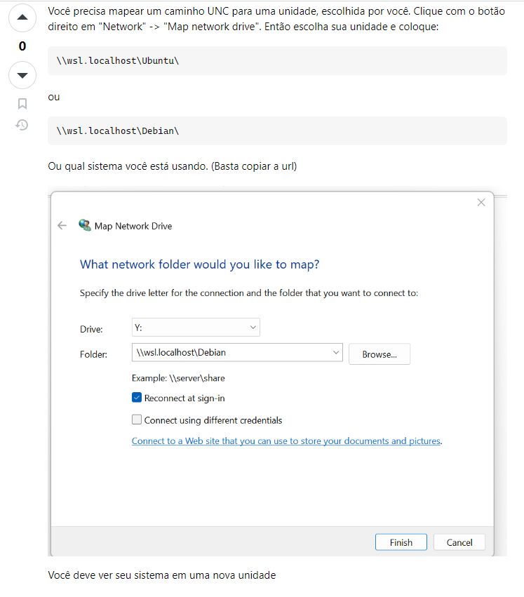

# tcc-front-end-2


Shell abaixo é necessário para rodar o servidor front end.
```sh
    curl -o- https://raw.githubusercontent.com/nvm-sh/nvm/v0.39.4/install.sh | bash
    source ~/.bashrc
    $ nvm --version
    $ nvm install 18
    $ nvm use 18
    $ node -v
    $ rm rf node_modules/
    $ sudo rm -rf node_modules
    $ git status
    $ git restore .
    $ npm install
```

Caso de erro de path, verificar o seguinte ponto:

\
https://stackoverflow.com/questions/74000168/running-an-express-server-from-wsl-unc-paths-are-not-supported

Opção para substituir o ... https://v3.vitejs.dev/guide/